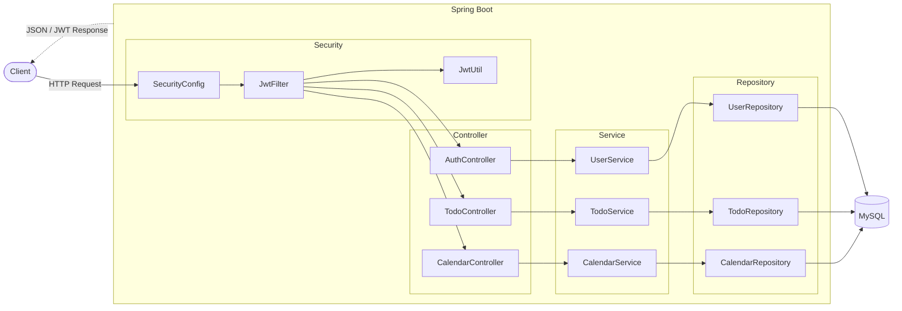

```mermaid
flowchart LR

    Client([Client])

    subgraph SpringBoot["Spring Boot"]
        subgraph Security
            SecurityConfig[SecurityConfig]
            JwtFilter[JwtFilter]
            JwtUtil[JwtUtil]
        end

        subgraph Controller
            AuthController
            TodoController
            CalendarController
        end

        subgraph Service
            UserService
            TodoService
            CalendarService
        end

        subgraph Repository
            UserRepository
            TodoRepository
            CalendarRepository
        end
    end

    DB[(MySQL)]

    Client --> SecurityConfig
    SecurityConfig --> JwtFilter
    JwtFilter --> JwtUtil

    JwtFilter --> AuthController
    JwtFilter --> TodoController
    JwtFilter --> CalendarController

    AuthController --> UserService
    TodoController --> TodoService
    CalendarController --> CalendarService

    UserService --> UserRepository
    TodoService --> TodoRepository
    CalendarService --> CalendarRepository

    UserRepository --> DB
    TodoRepository --> DB
    CalendarRepository --> DB

    AuthController -. JWT .-> Client
    TodoController -. Response .-> Client
    CalendarController -. Response .-> Client
```

```mermaid
flowchart LR

    Client([Client])

    subgraph SpringBoot["Spring Boot"]

        subgraph Security["Security"]
            SecurityConfig["SecurityConfig"]
            JwtFilter["JwtFilter"]
            JwtUtil["JwtUtil"]
        end

        subgraph Controller["Controller"]
            AuthController["AuthController"]
            TodoController["TodoController"]
            CalendarController["CalendarController"]
        end

        subgraph Service["Service"]
            UserService["UserService"]
            TodoService["TodoService"]
            CalendarService["CalendarService"]
        end

        subgraph Repository["Repository"]
            UserRepository["UserRepository"]
            TodoRepository["TodoRepository"]
            CalendarRepository["CalendarRepository"]
        end

    end

    DB[(MySQL)]

    Client -->|HTTP Request| SecurityConfig
    SecurityConfig --> JwtFilter
    JwtFilter --> JwtUtil

    JwtFilter --> AuthController
    JwtFilter --> TodoController
    JwtFilter --> CalendarController

    AuthController --> UserService
    TodoController --> TodoService
    CalendarController --> CalendarService

    UserService --> UserRepository
    TodoService --> TodoRepository
    CalendarService --> CalendarRepository

    UserRepository --> DB
    TodoRepository --> DB
    CalendarRepository --> DB

    SpringBoot -. JSON / JWT Response .-> Client
```
