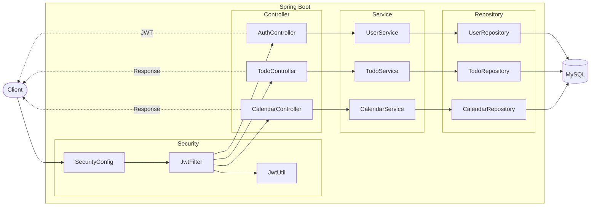
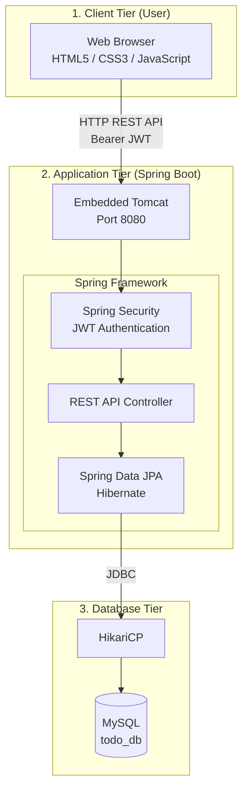

```mermaid
flowchart LR

    Client([Client])

    subgraph SpringBoot["Spring Boot"]
        subgraph Security
            SecurityConfig[SecurityConfig]
            JwtFilter[JwtFilter]
            JwtUtil[JwtUtil]
        end

        subgraph Controller
            AuthController
            TodoController
            CalendarController
        end

        subgraph Service
            UserService
            TodoService
            CalendarService
        end

        subgraph Repository
            UserRepository
            TodoRepository
            CalendarRepository
        end
    end

    DB[(MySQL)]

    Client --> SecurityConfig
    SecurityConfig --> JwtFilter
    JwtFilter --> JwtUtil

    JwtFilter --> AuthController
    JwtFilter --> TodoController
    JwtFilter --> CalendarController

    AuthController --> UserService
    TodoController --> TodoService
    CalendarController --> CalendarService

    UserService --> UserRepository
    TodoService --> TodoRepository
    CalendarService --> CalendarRepository

    UserRepository --> DB
    TodoRepository --> DB
    CalendarRepository --> DB

    AuthController -. JWT .-> Client
    TodoController -. Response .-> Client
    CalendarController -. Response .-> Client
```

```mermaid
flowchart TB

    subgraph ClientTier["1. Client Tier (User)"]
        Browser["Web Browser<br/>HTML5 / CSS3 / JavaScript"]
    end

    subgraph AppTier["2. Application Tier (Spring Boot)"]
        WebServer["Embedded Tomcat<br/>Port 8080"]

        subgraph Framework["Spring Framework"]
            Security["Spring Security<br/>JWT Authentication"]
            Controller["REST API Controller"]
            JPA["Spring Data JPA<br/>Hibernate"]
        end

        WebServer --> Security
        Security --> Controller
        Controller --> JPA
    end

    subgraph DBTier["3. Database Tier"]
        Pool["HikariCP"]
        DB[("MySQL<br/>todo_db")]

        Pool --> DB
    end

    Browser -->|HTTP REST API<br/>Bearer JWT| WebServer
    JPA -->|JDBC| Pool
```
