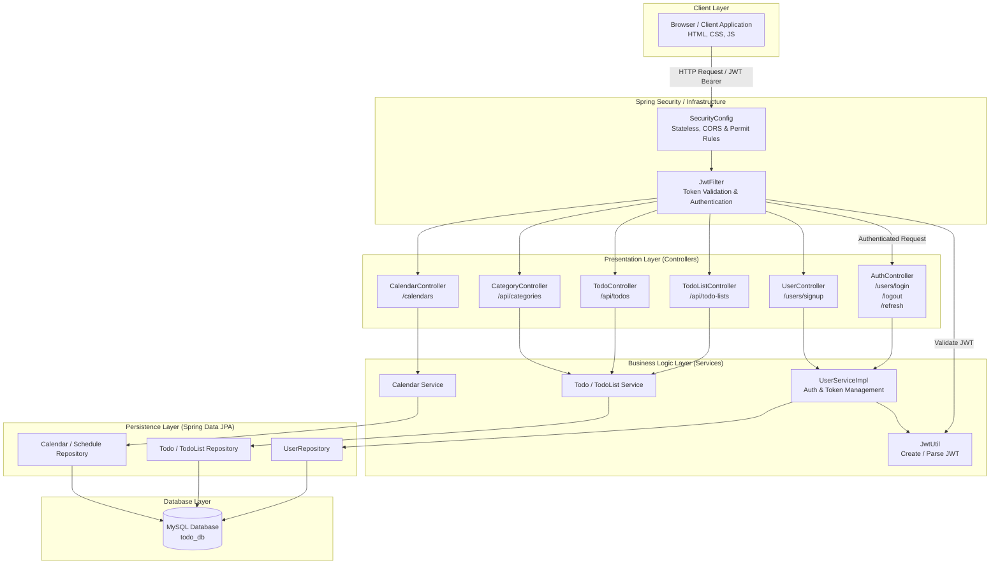

```mermaid
graph TD
    %% Client Layer
    subgraph Client["Client Layer"]
        WebBrowser["Browser / Client Application<br/>HTML, CSS, JS"]
    end

    %% Security Layer
    subgraph SecurityLayer["Spring Security / Infrastructure"]
        SecurityConfig["SecurityConfig<br/>Stateless, CORS & Permit Rules"]
        JwtFilter["JwtFilter<br/>Token Validation & Authentication"]
    end

    %% Controller Layer
    subgraph ControllerLayer["Presentation Layer (Controllers)"]
        AuthController["AuthController<br/>/users/login<br/>/logout<br/>/refresh"]
        UserController["UserController<br/>/users/signup"]
        TodoListController["TodoListController<br/>/api/todo-lists"]
        TodoController["TodoController<br/>/api/todos"]
        CategoryController["CategoryController<br/>/api/categories"]
        CalendarController["CalendarController<br/>/calendars"]
    end

    %% Service Layer
    subgraph ServiceLayer["Business Logic Layer (Services)"]
        UserService["UserServiceImpl<br/>Auth & Token Management"]
        TodoService["Todo / TodoList Service"]
        CalendarService["Calendar Service"]
        JwtUtil["JwtUtil<br/>Create / Parse JWT"]
    end

    %% Repository Layer
    subgraph RepositoryLayer["Persistence Layer (Spring Data JPA)"]
        UserRepo["UserRepository"]
        TodoRepo["Todo / TodoList Repository"]
        CalendarRepo["Calendar / Schedule Repository"]
    end

    %% Database Layer
    subgraph DatabaseLayer["Database Layer"]
        MySQL[("MySQL Database<br/>todo_db")]
    end

    %% Request Flow
    WebBrowser -->|HTTP Request / JWT Bearer| SecurityConfig
    SecurityConfig --> JwtFilter
    JwtFilter -->|Validate JWT| JwtUtil
    JwtFilter -->|Authenticated Request| AuthController
    JwtFilter --> UserController
    JwtFilter --> TodoListController
    JwtFilter --> TodoController
    JwtFilter --> CategoryController
    JwtFilter --> CalendarController

    %% Controller → Service
    AuthController --> UserService
    UserController --> UserService
    TodoListController --> TodoService
    TodoController --> TodoService
    CategoryController --> TodoService
    CalendarController --> CalendarService

    %% Service → Util / Repository
    UserService --> JwtUtil
    UserService --> UserRepo
    TodoService --> TodoRepo
    CalendarService --> CalendarRepo

    %% Repository → Database
    UserRepo --> MySQL
    TodoRepo --> MySQL
    CalendarRepo --> MySQL
```
